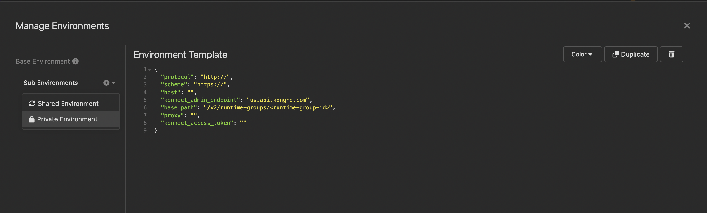

# Kong Insomnia Collection

Insomnia Collection for [Kong Konnect Kickstart Project](https://github.com/irishtek-solutions/kong-konnect)

# Insomnia REST Collection for Kong Konnect

This repository contains an Insomnia Collection designed to work seamlessly with the [Kong Konnect Kickstart Project](https://github.com/irishtek-solutions/kong-konnect) Github repository, a powerful library of Konnect resources. With Insomnia's GitHub integration, you can clone this repository to have all the API requests readily available for your Kong Konnect integrations.

## Table of Contents

- [Kong Insomnia Collection](#kong-insomnia-collection)
- [Insomnia REST Collection for Kong Konnect](#insomnia-rest-collection-for-kong-konnect)
  - [Table of Contents](#table-of-contents)
  - [Getting Started](#getting-started)
  - [How to Use the Collection](#how-to-use-the-collection)
    - [Setting Environment variables](#setting-environment-variables)
  - [Contributing](#contributing)

## Getting Started

To get started with this Insomnia REST collection for Kong Konnect, follow these steps:

1. Open up Insomnia (download available [here](https://insomnia.rest/download))
2. Click on the `+` icon and select `Git Clone`

3. If you haven't authenticated with Github already please do so. Copy this repository in the `Github URI` section like below:

4. This will clone the resources and you should now see a list of folders filled with requests:

## How to Use the Collection

### Setting Environment variables

The collection is organized into folders and requests to assist you in performing various tasks related to Kong Konnect, including managing entities, configuring plugins, and more. Each request is pre-configured with appropriate headers and parameters.

You can customize these requests to fit your specific use case. Be sure to provide your own API credentials, endpoints, and other configuration parameters where necessary in the environment section. To set up the environment section. Do the following:

1. Click on the Environment section in Insomnia (top left gear icon highlighted)

2. Create a new Private environment

3. Copy the JSON in the `Environment Template` section and paste into the private environment
4. The two most important settings to configure would be the `proxy` endpoint as this is the endpoint we will use to test Kong. In my example, it's `http://localhost:8000` as this is the default HTTP endpoint for the proxy. This could be the load-balancer address of the proxy also. The other is `konnect_access_token`, this is the Personal access token or System Access token which should be obtained from Konnect. 

## Contributing

If you'd like to contribute to this repository or report issues, please follow the guidelines provided in [CONTRIBUTING.md](CONTRIBUTING.md)